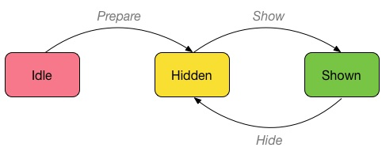

# Mini-State-Machine
> A tiny Finite State Machine

 [](https://www.npmjs.com/package/mini-state-machine)

## About

State machines are extremely useful pieces of functionality that ensure some state of a custom system. Using state machines (or _Finite State Machines_) allows you to define states for a system and all possible transitions between those states, ensuring the system follows only a certain amount of paths between states. An attempt to deviate from the allowed paths will always result in an error (as well as the initial state being preserved).

State machines such as this one can help you map out your states and transition pathways:



Such a diagram can easily be modelled as a state machine using this library:

```typescript
import { createStateMachine } from "mini-state-machine";

createStateMachine({
    initial: "idle",
    transitions: [
        { name: "prepare", from: "idle", to: "hidden" },
        { name: "show", from: "hidden", to: "shown" },
        { name: "hide", from: "shown", to: "hidden" }
    ]
});
```

### Why

Existing solutions were a bit too bloated for my use case - I needed a small and functional state machine with asynchronous transitions. Mini-State-Machine is my take on the bare minimum. If you have suggestions on how I could make it smaller, please create an issue!

Currently the NodeJS version is **less than 5kb minified!**

### Usage

Usage is simple: Create a state machine instance and you're ready to go!

```typescript
import { createStateMachine } from "mini-state-machine";

const sm = createStateMachine({
    initial: "hidden",
    transitions: [
        { name: "show", from: "hidden", to: "shown" },
        { name: "load", from "shown", to: "loaded" },
        { name: "hide", from: "*", to: "hidden" }
    ]
});

await sm.transition("show");
sm.state; // "shown"

await sm.transition("show"); // Exception: No path for this transition
```

Event handlers can be attached so each transition can be watched using callbacks. Transitions can be **cancelled** in the `"before"` and `"leave"` callback types by either returning `false` or throwing an error (or rejecting a `Promise`).

```typescript
sm.on("before", "show", () => {
    if (someTest()) {
        // cancel show
        return false;
    }
});

sm.on("leave", "hidden", () => {
    throw new Error("Some error");
    // or
    return Promise.reject(new Error("Some error"));
});
```

_By throwing an error, the original `transition()` call will be rejected with that error._

The methods `off(type, stateOrTransitionName, callback)` and `once(type, stateOrTransitionName, callback)` are also available and function like normal event emitter properties. `on()` and `once` also return an Object that contains a `remove` property method, which removes the listener when called.

You can also listen to all events by using an asterisk:

```typescript
sm.on("after", "*", event => {
    // 'event' :
    // {
    //     from: "state1",
    //     to: "state2",
    //     transition: "doSomething"
    // }
});
```

Check out the [API documentation](API.md) for more information.

#### Checking State

You can check the current state by using `sm.state`. For convenience you can also use `sm.is("someState")`.

You can also check whether a transition is possible by calling `sm.can("show")`, or if it is impossible by calling `sm.cannot("hide")`.

#### History

You can get the entire history of the state machine by calling `sm.getHistory()`. This method is expensive as it clones (using JSON) the entire history collection before returning it.

Each history item will conform to the following structure:

| Property      | Type          | Description                                           |
|---------------|---------------|-------------------------------------------------------|
| tsStart       | Number        | The timestamp at which the transition started.        |
| tsEnd         | Number        | The timestamp at which the transition ended.          |
| state         | String        | The state that was set at the end of the transition.  |
| previous      | String        | The previous state before the transition.             |
| transition    | String        | The transition name.                                  |

#### Event Lifecycle

The events for a transition occur in the following order:

 * **before** _transition_ (cancelable)
 * **leave** _state_ (cancelable)
 * **enter** _state_
 * **after** _transition_

Returning a `Promise` in any of these delays the transition. The callbacks for before, leave, enter and after events are called serially, which means that a failure or delay in one will affect the following callbacks (a failure meaning that they will not be called at all).

The exact time at which the state is changed is between **leave-state** and **enter-state**, and once the enter-state procedure has been started it is already to late to cancel the transition.

## Installation

Run the following to install:

```
npm install mini-state-machine --save
```

_This library supports **NodeJS 16** as a minimum compatible version_.

This package is in **ESM** module. It needs to be bundled with a tool like _Webpack_ before being used in the browser.
